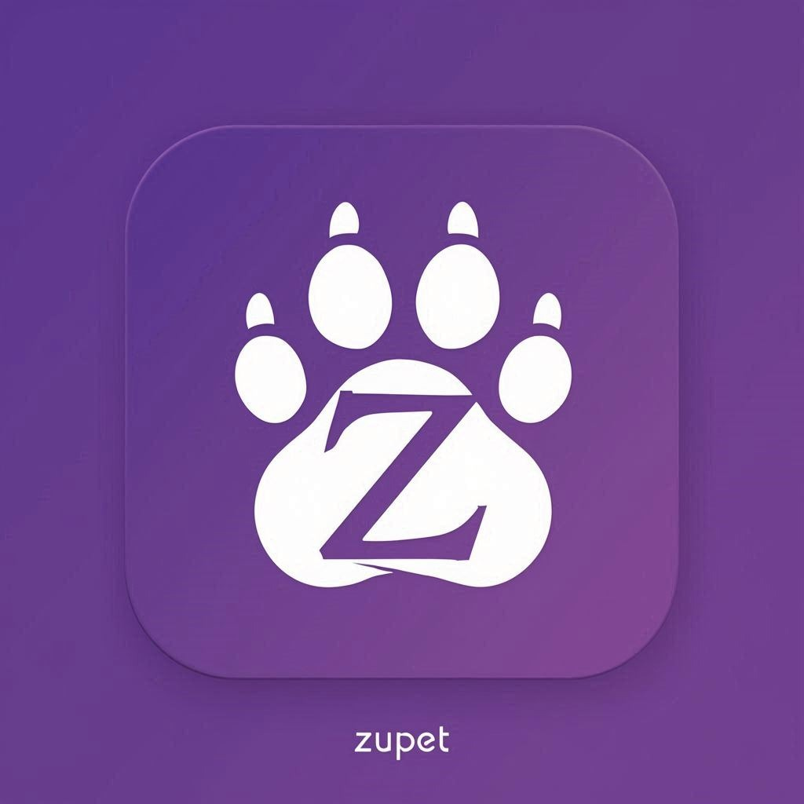
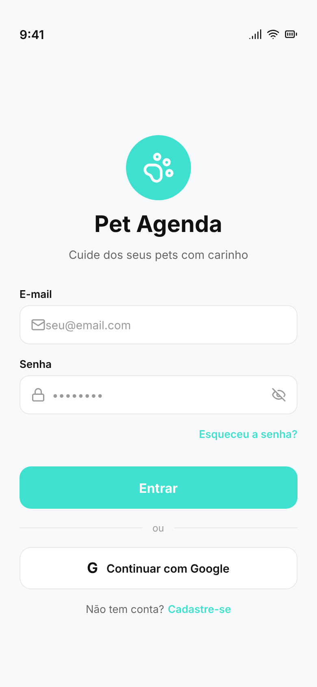
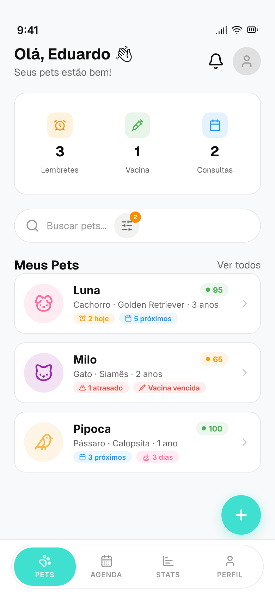
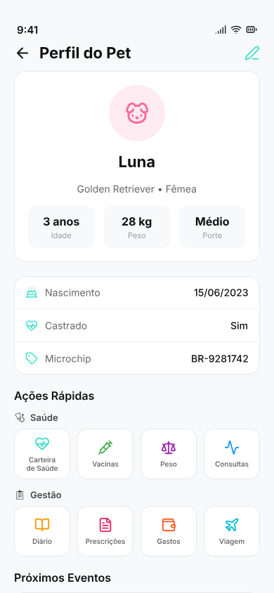
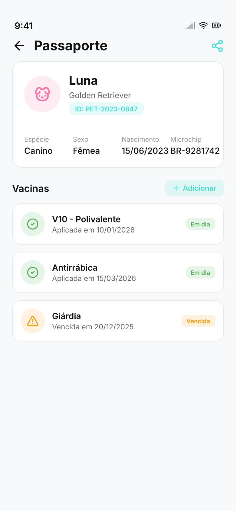
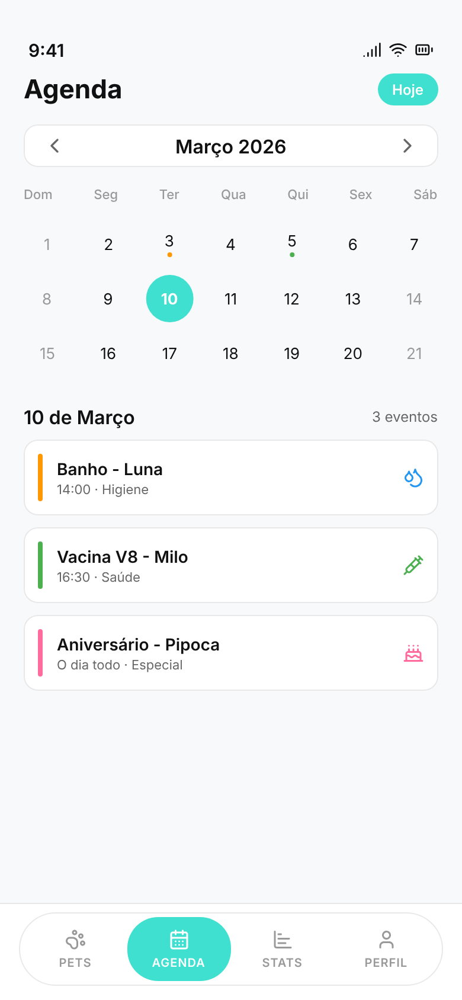
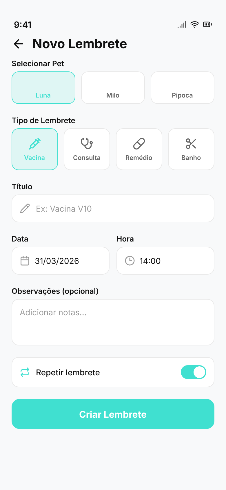
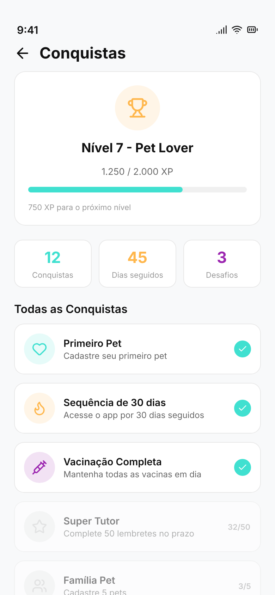
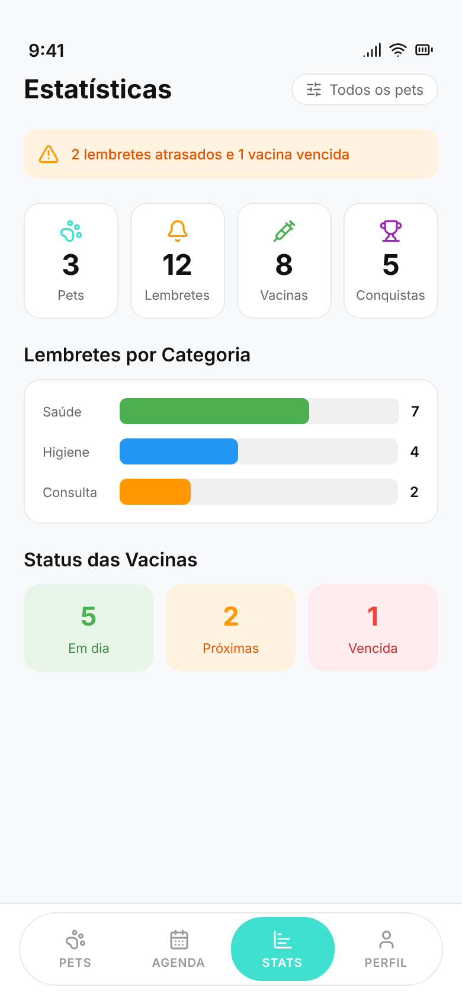

# zupet.io

**A vitrine e o coração do Zupet.**

Landing page, painel administrativo e analytics —
tudo que move o app por baixo dos panos.

---

## 🌍 O que é este projeto?

Este repositório contém duas partes que trabalham juntas:

**Landing page pública** (`zupet.io`) — apresenta o Zupet para novos usuários, com screenshots do app, funcionalidades, depoimentos e links para download nas lojas.

**Dashboard administrativo** (`zupet.io/dashboard`) — painel privado com analytics em tempo real sobre usuários, pets cadastrados, conquistas desbloqueadas, exclusões e muito mais.

---

## 🖥️ Landing Page

Uma página desenhada para converter visitantes em usuários. Cada seção foi pensada para comunicar o valor do Zupet de forma direta e bonita.

**O que você encontra:**

- Hero com mockup do app animado
- Contadores ao vivo de usuários e pets cadastrados
- Seção de funcionalidades com cards interativos
- Carrossel de screenshots reais do app com lightbox
- Seção de passaporte com visual de destaque
- FAQ completo
- Botões de download para Android e iOS
- Rastreamento de page views e cliques nas lojas

---

## 📊 Dashboard Administrativo

Painel protegido por autenticação com visão completa sobre o crescimento do Zupet.

**Métricas disponíveis:**

| Seção | O que mostra |
|---|---|
| **Visão Geral** | KPIs principais, crescimento recente |
| **Usuários** | Lista completa, plataforma, localização |
| **Pets** | Espécies, raças, castração, idade |
| **Analytics** | Gráficos de crescimento, engajamento, conquistas |
| **Exclusões** | Motivos de saída, memoriais |
| **Landing** | Page views, cliques nas lojas por dia |

---

## 📸 Screenshots do App

| Login | Meus Pets | Perfil | Passaporte |
|:---:|:---:|:---:|:---:|
|  |  |  |  |

| Agenda | Lembretes | Conquistas | Estatísticas |
|:---:|:---:|:---:|:---:|
|  |  |  |  |

---

## 🌐 Links

| | |
|---|---|
| 🌍 Landing page | [zupet.io](https://zupet.io) |
| 📲 App no Google Play | [Download gratuito](https://play.google.com/store/apps/details?id=io.zupet.app) |
| 📜 Política de Privacidade | [zupet.io/privacidade](https://zupet.io/privacidade) |
| 📄 Termos de Uso | [zupet.io/termos](https://zupet.io/termos) |

---

Feito com 🐾 para todos os tutores que amam seus pets de verdade.

